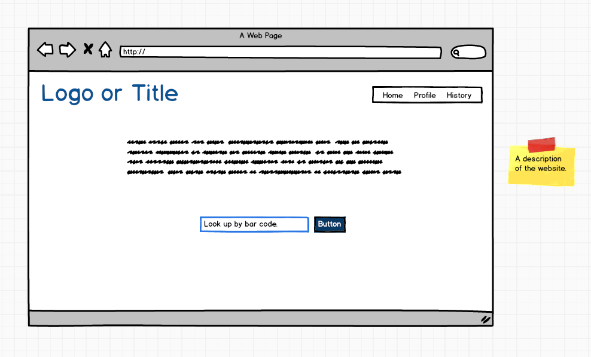
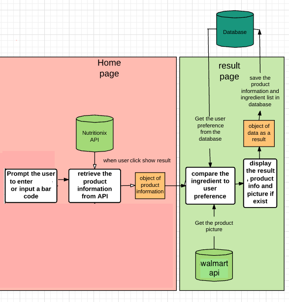
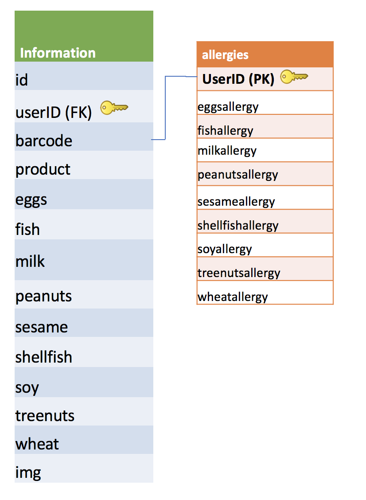

<a name="goback">

# Project 3 (Can I Eat This?)
## Live: https://esraa-alaarag.github.io/can_I_eat_this/

</a>

### Team: Esraa, Francheska, Naomi

## Table of Contents

1. [App description](#appdescription)
2. [User Stories](#userstories)
3. [Wireframes Web Version](#wireframesweb)
4. [Visual representation of the database](#database)
5. [Pseudocode](#pseudocode)
6. [APP flowChart](#workflow)
7. [ERD or other visual representation of your database](#database)
8. [Technologies used](#technologies)
9. [Ways to see the project](#project)

<a name="appdescription">

## APP DESCRIPTION:

An app for people who care about the ingredients in their food!

Step 1: Users register their dietary restrictions on the user preferences page and can save their issues. Such as allergies to peanuts or shellfish, lactose intolerant, gluten-free, or other specific dietary restrictions. 

-	Current allergen list:

	-	Peanut
	-	Tree Nuts
	-	Milk (lactose intolerant)
	-	Egg
	-	Wheat (gluten-free)
	-	Soy
	-	Fish
	-	Shellfish
	-	Sesame

Step 2: Users enters the item UPC( bar code number) . it should be 12 digit number.

Step 3: The app displays the results of the thorough ingredient check (over 60 keywords for each) and indicates whether the user can eat the item or not. Rendering each of the unique allergen issues and whether they are present in the product or not.

Step 4: In history, the user can save their past products searched and preferences, stored in an external database. or delete it

</a>

<a name="userstories">

## USER STORIES:

- As a user, I want to use the app in the browser and on a mobile device.

- As a user, I want to see cute icons for each of my allergen preferences.
- Like this:       

- As a user, I want to add and edit the ingredients I am careful about in my User Profile.

- As a user, I want the option to write the barcode, and immediately see if the product contains any ingredients I don't want.

- As a user, I want to 'red flag' ingredients I am careful about. Such as items I am allergic to examples include: peanuts, gluten, dairy, etc. 

- As a user, when I enter the product barcode, I want to know if I'm using the wrong number of digits or letters by mistake.

- As a user, I want an editable history of all the products I already looked up.

- As a user I want to be able to delete the item from my hisroty if i'm not longer interseted in

- As a user, I want to see the product picture (if available) and see the list of ingredients.

- As a user, I want to edit my allergen preferences in the profile page and get an updated history page.
</a>

<a name="wireframesweb">

## WIREFRAMES:
## (Web/Browser Version)

### Here is the initial thinking we started with:

### Homepage:

### Product Info:

### User Profile:

### History:

</a>

<a name="pseudocode">

## PSEUDOCODE:

1. Grab the item barcode from input field.
2. Validate the barcode, 12 digits number
3. Make an axios call to find the product information (product name, ingredients)
4. Use the barcode to call another API for the picture 
5. Get the user list of allergies from the database
6. Compare the product ingredients the user’s allergies 
7. Store the comparison information from the two APIs to database 
8. Display the picture of the product if found or use a placeholder
9. Allow the user to change their list of issues, after clicking on the profile page
10. Display the previously selected issues and allow the user to modify selections 
11. If the user wants to see the previously searched items, allow user to click on History page
12. Allow the user to delete a product by clicking on X
13. For wrong links, 404 page is available.

</a>

<a name="database">

## ERD/VISUAL REPRESENTATION OF DATABASE:

</a>

<a name="technologies">

## TECHNOLOGIES USED:

### Core Stack:

- React
- Node
- Express
- PostgreSQL
- HTML
- CSS
- JavaScript 
- jQuery
- Heroku
- Git

### Middleware:

- nodemon
- pg-promise
- axios
- react-routers
- cors
- CSS Frameworks

### APIs:

- Nutritionix API
- Walmart API

### Also

- ZenHub (project boards)
- Balsamiq (wireframes)
- Lucidchart (app/project flow)
- Slack (communication)
- Postman (API and DB testing)

</a>

<a name="project"> 

## SEE THE PROJECT:

### Live Deployment of App: https://esraa-alaarag.github.io/can_I_eat_this/

Database hosted on Heroku:

- https://can-i-eat-this-api.herokuapp.com/
- To access the products information: https://can-i-eat-this-api.herokuapp.com/api/information
- To access the user issues: hhttps://can-i-eat-this-api.herokuapp.com/api/allergies
- GitHub of database: https://github.com/Esraa-Alaarag/API-can-I-eat-this.git

### Download Project & Install

1. Git clone or download this project
2. https://github.com/Esraa-Alaarag/can_I_eat_this.git
3. Make sure to `npm install`
4. Run `npm start` and app should be available on localhost:3000

Thanks :) 

</a>

[Go Back to the Table of Content](#goback)
